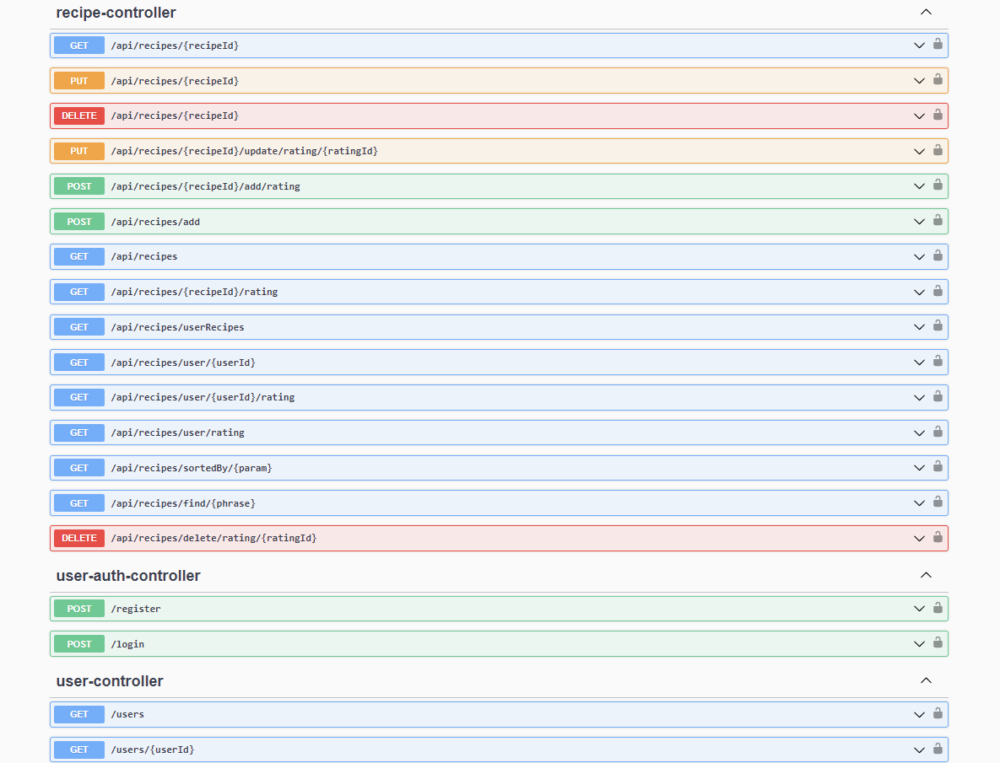

# **RecipeApp Backend**

RecipeApp is a backend application designed to support a dynamic platform for users to add and browse recipes. It enables users to post their own recipes, complete with ingredients and instructions, while also providing functionality for users to view recipes created by others.
In addition to recipe management, RecipeApp allows users to leave reviews and ratings for recipes posted by other users.

## Table of Contents 
1. [Description](#description)
2. [Requirements](#requirements)

## Description

RecipeApp is an innovative backend application designed for food enthusiasts to easily share, discover, and manage recipes. It serves as a robust platform where users can add their culinary creations, including titles, ingredients, descriptions, and images.

Key Features:

1. Recipe Creation: Users can create new recipes by entering a title, listing ingredients, and providing detailed cooking instructions. The application allows for the uploading of images, which improves the presentation of each recipe.

2. User Authentication: To access the features of RecipeApp, users must log in to their accounts. New users can quickly register to join the community.

3. Recipe Management: Users can easily edit their recipes if any updates are needed. This includes changing the title, ingredients, descriptions, or images. If a recipe is no longer required, users can also delete it easily.

4. Search and Sort Functionality: RecipeApp includes a powerful search feature that allows users to find recipes based on specific keywords or phrases. Additionally, users can sort recipes by various criteria, including:

    Highest ratings 

    Lowest ratings

    Most recent

    Alphabetical order (by title)
   
6. Community Engagement: Users can leave reviews and ratings on recipes shared by others, fostering interaction and collaboration within the culinary community. This feedback mechanism helps users discover popular dishes and share their culinary experiences.

Screenshot of Swagger API documentation showing available endpoints:

Technology Stack:

RecipeApp is created using Java and the Spring Boot framework, which makes it easier to develop the application and allows it to grow as needed. The application uses a MySQL database to store data efficiently and ensure quick access to information. This choice of technologies makes the backend strong, easy to manage, and simple to deploy.

## Requirements

List the dependencies and software versions required:

1. **Java Development Kit (JDK)**:
   - The application requires JDK 17 or higher. You can download it from [Adoptium](https://adoptium.net/) or [Oracle](https://www.oracle.com/java/technologies/javase-jdk11-downloads.html).

2. **Maven**:
   - Apache Maven is required to manage the project’s dependencies and build the application. You can download it from the [Maven website](https://maven.apache.org/download.cgi).

3. **MySQL Database**:
   - MySQL is used for data storage. Ensure that you have MySQL installed and running on your machine. You can download it from [MySQL Community Server](https://dev.mysql.com/downloads/mysql/).

4. **Dependencies**:
   - The project includes several dependencies for functionality, including:
     - **Spring Boot Starter Data JPA**: For data access and manipulation.
     - **Spring Boot Starter Web**: To build web applications.
     - **Spring Boot Starter Security**: For authentication and authorization.
     - **Springdoc OpenAPI**: For API documentation (version **2.0.2**).
     - **JUnit**: For testing purposes (version specified in the scope).
     - **Spring Security Test**: For testing security aspects (version specified in the scope).
     - **JWT**: For handling JSON Web Tokens for security (version **0.12.6**).
     - **H2 Database**: For in-memory testing (version **2.3.232**, only in test scope).

